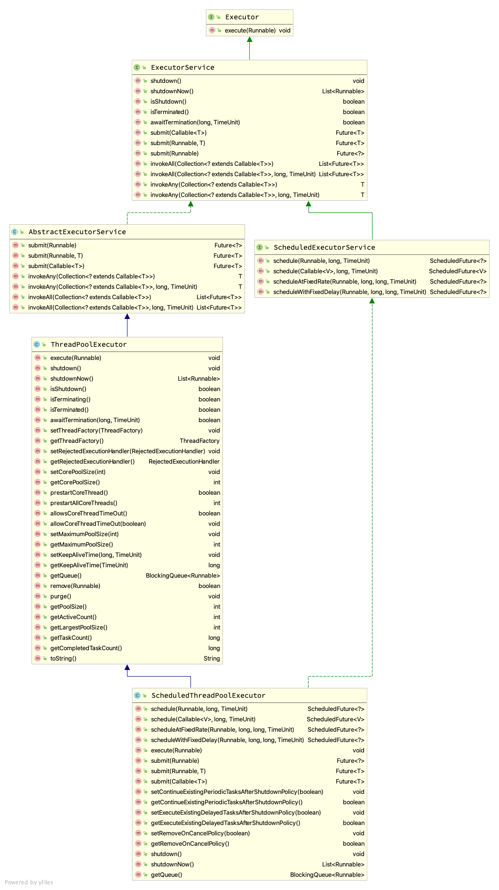
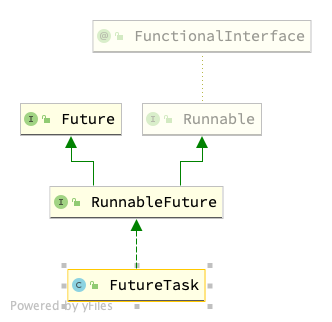

## 2. Java线程
### 2.1. 线程基本操作
#### 2.1.1. 创建一个线程并运行
 * 🆕一般来说，新建一个Thread对象，调用start()来启动，会把run()方法里定义的代码放在新建的线程里运行，而直接调用run()则不会。
 * start()方法的具体实现是JNI实现的，具体不表，大概就是新建线程然后跑run()里的东西。
#### 2.1.2. 终止线程
 * ❌不建议使用stop()方法，因为这会强制终止，进而导致代码在错误的位置被停下，致使数据不一致，这里建议使用实例方法interrupt()
#### 2.1.3. 中断线程
 * ✅实例方法interrupt()中断线程，其实就是设置中断标示位为true(默认为false)。
 * 可以通过实例方法isInterrupted()来判断当前线程是否被中断。进而在自己的代码里采取适当的处理措施。
 * 不过还有一个静态方法interrupted()来判断当前线程是否被中断，并清空中断标识，即，重新置为false。
#### 2.1.4. wait()和notify()
 * 这两个方法都是Object类自带的。
 * wait()方法会把调用它的线程停下来，放进自己的等待队列里去；而如果想让刚刚被停下的线程重新运行，只要调用同一个对象的notify()或notifyAll()方法即可。
 * 关于notify()和notifyAll()的区别，就是前者随机唤醒，后者全部唤醒。
 * ⚠️注意️，wait()并不能随便调用，应该在同步语句块里调用，因为线程调用某一对象的wait()时，会进入等待队列；但如果这个对象之前获得了监视器，进入等待队列就没法释放，就会造成没有其他对象可以获得这个监视器，进而无法把等待队列上的其他线程唤醒，导致其他线程的无法正常执行，所以wait()应该放在同步块里调用。此时wait()会自动释放监视器。
 * wait()时被中断会把线程从等待队列移出，让其参与锁的竞争，当得到了锁才会抛出中断异常。
   
 * 👀放在同步块只要是为了解决唤醒位丢失问题，这个操作系统有说，或者看这个文章：🔗[为什么wait()和notify()需要放在同步块？](https://juejin.cn/post/6844904088505679879)
 * 🔔wait()会自动释放锁，而Thread.sleep()则不会。同时，调用wait()的线程在被唤醒后，会尝试再次获得锁以运行，而不是直接运行。
#### 2.1.5. join()和yeild()
 * join()如其名，就是让这个方法的实例线程插队到当前线程前面去执行，一般用于A线程依赖B线程的计算结果，然后A就可以调用B.join()让B比自己先执行。
 * yeild()会让调用者线程释放自己的CPU时间，然后重新参与调度竞争。
### 2.2. volatile和JMM
 * volatile关键词告诉JVM被它修饰的变量极有可能被其他线程修改，所以要让这个修改立即被其他线程看到，但是⚠️这并不意味着修改一定会被看到！！！具体看这里：🔗[Java volatile关键词](https://www.cnblogs.com/dolphin0520/p/3920373.html)
### 2.3. 守护线程
 * 守护线程是在主线程背后运行的线程，一般在主线程结束后，守护线程就会自然退出。
### 2.4. 线程优先级
 * 🛠可以通过设置线程优先级来控制线程被调度的顺序，但这并不具备强制性，也是一个仅供参考的存在，不过大多数情况下高优先级的线程更有可能被执行。
### 2.5. synchronized关键词
 * 🔒synchronized关键词可作用于三个场景，分别是：🔐指定对象解锁，🔐直接作用于实例方法，🔐作用于静态方法。
 * ✅第一种加锁方式本质是获得加锁对象的监视器；✅第二种即把加锁对象换成了当前对象实例；✅第三种即把加锁对象换成了当前类对象。
## 3. JDK并发包
### 3.1. 同步控制
#### 3.1.1. synchronized的替代品——重入锁
 * ReentrantLock锁可以被一个线程多次加锁，但是解锁也必须释放同样数量的锁。
 * ReentrantLock的lockInterruptibly()会在线程被中断时，取消对于锁的尝试获取，进而释放锁，这种形式一定程度上可以缓解死锁的发生。
 * tryLock()方法会直接返回，如果获取锁成功，返回true，否则返回false。另外，它可以设置请求超时，如果在请求时间内没有得到锁，就会返回false，否则true。所以相比之下tryLock()就是这个方法的立即形式。
 * 同时因为tryLock()是立即返回的，所以可以写成while(true) {} 形式；会在一定程度上缓解死锁。
#### 3.1.2. Condition介绍
 * 🆚Condition之于ReentrantLock就像Object.wait()和Object.notify()之于synchronized。
 * 通过newCondition()方法，可以获取与当前重入锁绑定的Condition对象。
 * await()方法可以被中断，此时会跳出等待，过程和Object.wait()类似。另一个方法，awaitUninterruptibly()会忽略中断。
 * 🔓signal()后应该释放锁，手动释放。
 * 其他API详见源码
#### 3.1.3. Semaphore介绍
 * Semaphore是信号量，它像重入锁的扩展，可以指定资源数量，进而允许多个线程访问临界区。构造方法指出了详细数量。
 * 🔒acquire()会申请一个信号量，如果无法得到会一直阻塞，acquireUninterruptibly()会忽略申请过程中的中断。
 * tryAcquire()类似tryLock()。
 * 🔓release()类似unlock()。
#### 3.1.4. ReadWriteLock介绍
 * 对于一些系统(比如数据库)，其读操作比写操作多太多，那么就可以实现读写分离。
 * 读写锁的读操作虽然也要加锁，但是✅多个读操作之间并不阻塞，只有：🚫读-写；🚫写-读；🚫写-写之间才可能阻塞。
#### 3.1.5. CountDownLatch介绍
 * CountDownLatch有一个构造方法，传入一个计数个数；以及一个实例方法countDown()，它会把计数器-1。
 * 通过实例方法await()可以阻塞当前线程直到计数器为0，而这，就是倒计时计数器——倒数到零开始运行。
#### 3.1.6. CyclicBarrier介绍
 * 这是一个功能更加复杂，也更加强大的倒数计数器。它的构造方法包含两个参数；一个是计数器个数，一个是计数器为0时执行的指令。
 * 🆚它和CountDownLatch有点不同，因为它在调用await()方法时会自动-1计数器，当某一个线程调用await()而导致计数器等于0时，会触发构造方法里指明的Runnable()运行。♻️同时会设置新一轮触发，也就是计数器归位。
#### 3.1.7. LockSupport介绍
 * LockSupport可以直接阻塞线程而不会抛出异常，且不用获得锁，也解决了resume()方法的问题。
 * ⛔️LockSupport.park()可以阻塞当前线程；
### 3.2. 线程复用——线程池
#### 3.2.1. 线程池的意义
 * 频繁地创建和销毁线程，对CPU来说是很大的负担，所以可以使用线程池，做到对线程的随用随取，用完归还。
#### 3.2.2. JDK提供的线程池
 * JDK的Executor接口仅提供一个execute(Runnable)方法。

   
 * 其中，Executors为ExecutorService提供了一系列的静态方法来进行构造。
#### 3.2.3. 探其实现
 * 探究源码可发现，Executors提供的方法本质是对ThreadPoolExecutor的封装。
 * ThreadPoolExecutor构造器中最重要的参数莫过于workQueue和handler，至于线程工厂，这个比较简单，使用默认的即可(源码默认实现非常简单)。
 * 一般来说，工作队列的提供可以使用以下几种:
 * SynchronousQueue(没有容量，直接提交，提交的任务不会保存，如果此时刚好有一个任务执行完毕，那么使用这个已完成任务的线程执行被提交的任务，否则创建新的线程，此时要记得设置很大的maximumPoolSize)。
 * ArrayBlockingQueue(有界任务队列，提交任务，如果实际线程数小于corePoolSize，则优先创建线程执行任务，否则加入等待任务队列，如果队列已满，在线程数小于maxPoolSize时创建线程，否则执行拒绝策略)。
 * LinkedBlockingQueue(无界任务队列，提交任务，如果实际线程数小于corePoolSize，则优先创建线程，否则添加至等待任务队列)。
 * PriorityBlockingQueue(优先任务队列，无界，且根据优先级策略对任务进行排序)。
#### 3.2.4. 拒绝策略
 * 当系统无法接受更多的任务时，就会触发拒绝策略。
 * JDK提供了一些默认拒绝策略，可以查看源码了解。
#### 3.2.5. 扩展ThreadPoolExecutor
 * ThreadPoolExecutor的beforeExecutor()和afterExecutor()方法可以进行扩展，实现debug功能。
#### 3.2.6. 获取调用堆栈
 * execute()会在出错时打印堆栈，但是submit()不会，不过可以通过submit()的返回值获取。
#### 3.2.7. Fork/Join
 * fork()划分任务，放入两个线程执行，join()合并子线程执行结果，返回到上层。
 * fork/join存在工作窃取，就是某个线程完成计算后，会尝试拿其他线程的任务队列的任务来计算，一般从队尾获取，而获取自己的则从队头，这样可以减少一部分竞争。
 * 具体用法见源码
### 3.3. JDK并发容器
#### 3.3.1. 并发集合简介
 * ConcurrentHashMap: 线程安全的HashMap。
 * CopyOnWriteArrayList: 在读多写少的场合，这个List性能很好。
 * ConcurrentLinkedQueue: 线程安全的LinkedList
 * BlockingQueue: 阻塞队列，适合做数据共享的通道。
 * ConcurrentSkipListMap: 跳表，适合做快速查找。
 * Collections的工具类。
#### 3.3.2. 探索ConcurrentLinkedQueue
## 4. 锁优化
### 4.1. 提高锁性能的建议
 * **减少锁的持有时间**(不把锁无关代码放在同步块里)。
 * **减小锁粒度**(不要对整个程序加锁，尽可能把操作分散，让每个线程请求不同的部分，这样有几率实现真正的并发，比如ConcurrentHashMap会使用散列把请求打散开，默认16个分区，每次get(), put()会先计算散列值，再去相应的块请求，即可实现不同线程不同同步块，做到真正的并发)。不过，这种方式在**请求全局信息时会降低性能**，因为这种方式适用于全局性不高，可以做到分散请求的程序。
 * **使用读写分离锁**(在读写请求次数差距很大时，这种锁可以很大的提高性能)。
 * **锁分离**(如果两个操作互不干扰，那么可以使用分离锁，比如同步队列的take()和put()方法。可以做到take()与take()之间同步，put()和put()之间同步，而take()与put()之间不需要同步，这就需要两把锁来实现)。
 * **锁粗化**(如果两个操作相离很近，那么可以考虑放在同一个同步块中，因为锁的申请和释放也是一个耗费资源的事)。
### 4.2. JVM对锁的优化
#### 4.2.1. 锁偏向
 * JVM会把程序优化为: 如果一个线程获得了锁，那么会倾向于让它下次再次获得锁，这在竞争比较小的场合比较适用。
#### 4.2.2. 轻量级锁
 * 通过把对象头引用到锁来实现，如果失败会升级为重量级锁(也就是普通的加锁/解锁)。
#### 4.2.3. 自旋锁
 * 每次申请不到锁就阻塞线程，然后再次调度，成本未免还有点大，所以会考虑把线程自旋一会再尝试，这适用于锁竞争不激烈会锁使用时间短的场景。
#### 4.2.4. 锁消除
 * JVM会自动去处代码里写了但是实际没用的锁，判断依据是逃逸分析技术。所谓逃逸分析就是看某个变量是否会逃出某一个作用域。如果这个变量被另一个方法使用了，就说明它有可能被修改，就不能删去锁。
### 4.3. ThreadLocal
 * 用来保存每个线程独有的变量，通过set(T value)和get()方法进行设置和获取。
 * 维护了一个(x, y) -> z的映射，其中，x是当前线程，y是ThreadLocal实例，z是变量。
 * 每次像ThreadLocal实例set(T val)，都会把这个值放进当前线程保存的ThreadLocalMap实例里去，其中key是ThreadLocal实例，val为value。如果当前线程的ThreadLocalMap为空，就创建，再设置值。
 * 每次get()都会先获取当前线程的ThreadLocalMap实例，是一个Map，然后以当前ThreadLocal实例为key获取value。
 * 关于线程池的ThreadLocal保存的变量释放问题，可以调用remove()来移除，或者可以把实例指针置为null来加速GC过程，比如让实例threadLocal = null即可。原因在于ThreadLocalMap的Entry是弱引用，一旦为空，则立刻回收。
 * 关于使用场景，在对线程某一变量竞争比较激烈的时候，ThreadLocal可以很好的减轻这个问题。
### 4.4. 无锁
#### 4.4.1. CAS(Compare And Set)操作
 * CAS在于在指令层面提供原子操作，进行"比较"，"替换"。一般来说CAS(offset, oldVal, newVal)需要三个参数: offset指出需要更新的值在内存中的位置，oldVal是这个内存位置期望的值，newVal是想要进行替换的值。如果内存位置的值=oldVal，说明未被别的线程更新，则使用newVal替换，如果这个内存位置的值和oldVal不一致，说明已经被别的线程更新了，那么不进行操作。
 * CAS指令现已被大多数现代CPU支持，JDK使用CAS实现了一些原子类，以此来进行无锁操作。
 * JDK的atomic包下提供了一系列方便的包装类型，可以查看相关类了解用法。
#### 4.4.2. AtomicXxxx类
 * 诸如AtomicInteger，AtomicDouble，AtomicLong之类的，都是对基本类型的封装。
#### 4.4.3. AtomicReference
 * 此类旨在包装自定义类型，来实现原子操作。但是它没法保证更新同一个值的情况，也就是无法做到记录对象的状态值。比如把A更新为B，过会又更新成了A，那这是无法记录的。
#### 4.4.4. AtomicStampedReference
 * 此类引入了时间戳进行状态记录，确保可以在更新对象时校检对象状态。
#### 4.4.5. AtomicXxxArray
 * 此类型对数组进行了原子包装，可以使得数组操作享受原子操作。
#### 4.4.6. AtomicXxxFieldUpdater
 * 此类型可以在几乎不改动原有代码的情况下，对域变量进行原子操作包装。
#### 4.4.7. SynchronousQueue
 * 它的实现有点像AQS的acquire()方法，可以参考源码理解。

来看一张图指出了Java的锁(图来自美团技术团队)


## 5. 并行模式和算法
### 5.1. 单例模式
 * 整个系统只有一个类实例，因此在多线程中有着更好地应用，但是如何确保在并发环境中只会被创建一个实例则是重中之重。
### 5.2. 不变模式
 * 确保对象的绝对不可变——既不能被外界改变，也不能被自己改变，强于"只读模式"。
### 5.3. 生产者-消费者模式
 * 这个，就是，怎么说呢...很熟悉就是了，多个生产者线程负责向缓冲区(在这里是阻塞队列)写数据，如果缓冲区满了，则挂起，直到某一个消费者线程发现缓冲区数据为0，随即唤醒一个生产者线程；消费者反之亦然。
### 5.4. 高效的生产者-消费者模型
 * Disruptor是一个高性能的无锁内存队列，用来实现生产者-消费者模型很合适。
### Future回调
 * 首先明确一件事，就是在Java中，Thread.start()之后调用Runnable.run()方法。这里有两个限制，一是调用的必须是Runnable，而是必须是run()方法。
 * Java中的Callable<V>的V call()方法是不能被Thread的start()调用的，所以有了Future接口+FutureTask类。Future就是一个普通的接口。指出可以对线程的异步操作。FutureTask把Runnable和Future结合在一起实现Callable的功能。



 * 或者可以这么理解，FutureTask是为了模拟Callable可以被Thread.start()而存在的。最明显的证据就是FutureTask重写了Runnable的run():

``` Java
public void run() {
    // 无关紧要的部分...
    try {
        // callable是作为构造参数设置的
        Callable<V> c = callable;
        if (c != null && state == NEW) {
            V result;
            boolean ran;
            try {
                // 在Runnable.run()里面直接调用Callable.call()并获取返回值(这是阻塞的)
                result = c.call();
                ran = true;
            } catch (Throwable ex) {
                result = null;
                ran = false;
                setException(ex);
            }
            if (ran)
                // 设置返回值
                set(result);
        }
    } finally {
        // 无关紧要的balabala...
    }
}
```

 * 至此我们就非常明确了，**FutureTask = 一个Runnable实现类，这个类会在run()里调用call()并设置返回值到私有域里去，通过get()可以获取这个返回值**。Callable和Future都是普通的接口，没有任何附加含义，Runnable是一个特殊的，可以被线程调度的接口。
 * 因为Callable()无法直接被线程start()，需要借助FutureTask来实现，所以可以封装一下再交由ExecutorService来实现调度，如果你直接提交Callable的话，ExecutorService会自动封装成FutureTask然后执行。
 * 顺带一提，为了规范化，ExecutorService会把提交的Runnable封装为没有返回值的FutureTask来执行(其实是RunnableFuture，为了好理解故意这么说的)。
 * 还有一点，可以重写FutureTask#done()来实现任务完成时的回调调用。
### 5.6. 并行流水线
 * 如果一个操作依赖另一个操作的完成，那就不能简单的开启多线程，但是如果又想实现多线程来增加性能(尤其在多核CPU上)，可以实现流水线思想。
 * A->B->C，这样的流水线执行，彼此顺序无法被打乱，那么可以让线程A执行任务A，让线程B执行任务B，线程C执行任务C。一开始B和C处于睡眠状态。在A执行完毕后，把执行结果发给B并唤醒B，B执行完毕进入睡眠并把结果发给C，唤醒C。
### 5.7. 并行搜索
 * 对于一个数组的检索，如果数组本身是乱序的，则只能老老实实地从头到尾检索，但是可以利用多线程，让每个线程检索一小部分，以提交检索效率。
 * 这里会用到Future来实现结果的保存，以及一个线程安全的全局变量来记录检索结果，用来当其他线程检索成功时可以直接返回，而不用继续检索。
### 5.10. NIO
